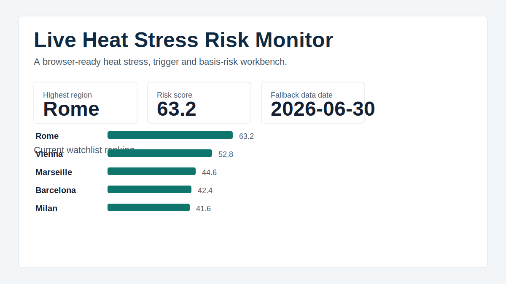

# Heat Stress Reinsurance Workbench



This is a small reinsurance analytics case study built around a current European heat event. The question behind it is practical: if a severe heatwave is unfolding, which regions should a reinsurer look at first, which insurance lines are under stress, and would a simple parametric heat trigger respond in a sensible way?

The easiest way to review it is the static browser preview:

[Open the browser preview](https://romanmski.github.io/europe-heatwave-reinsurance-risk-monitor/)

The full Streamlit workbench is in `app.py`. It includes live weather refresh, adjustable trigger wording, notional and cap controls, line-of-business weights, a city drilldown and a forward climate stress view.

## What The Project Does

The workbench combines Open Meteo weather data, local 1991 to 2020 climatology, simple exposure proxies and a transparent parametric payout model. It is not trying to be a black-box catastrophe model. The point is to show how a current event can be turned into a disciplined insurance analytics workflow.

The dashboard starts with a live portfolio queue, then goes deeper into why a region is flagged. It separates health, agriculture, energy, infrastructure and business interruption stress, then compares that stress with the selected contract trigger. That basis-risk check is the part I find most interesting, because a high temperature alone is not the full insurance question.

The forward view applies the same trigger design to CMIP6 projected summers. That makes it possible to see how often the selected wording might activate under future heat conditions. The numbers are scenario values based on a user-selected notional, not market loss estimates.

## Run It Locally

On Windows, double-click `run_local.bat` from the project folder.

From a terminal:

```bash
python -m pip install -r requirements.txt
streamlit run app.py
```

The first run downloads weather data and stores it under `data/cache/`. The cache is ignored by git, so the repository stays light.

## Technical Notes

The project is built with Python, pandas, DuckDB, Plotly and Streamlit. The static preview in `docs/index.html` is generated from the same model logic by `scripts/build_static_site.py` so that a recruiter or reviewer can open something immediately in the browser without installing Python.

The model uses maximum temperature anomaly, local percentile exceedance, heat streaks and heat degree days as the core heat-severity signal. The line-of-business modules then apply simple exposure proxies for health, agriculture, energy, infrastructure and business interruption.

Important limitation: this is a portfolio project, not underwriting advice. It does not include real insured values, policy wording, claims, crop yield models, grid topology, medical data, treaty terms or insurer accumulation data.

Data sources include Open Meteo forecast, historical weather and climate APIs, plus public background material from Swiss Re, WMO and WHO.
