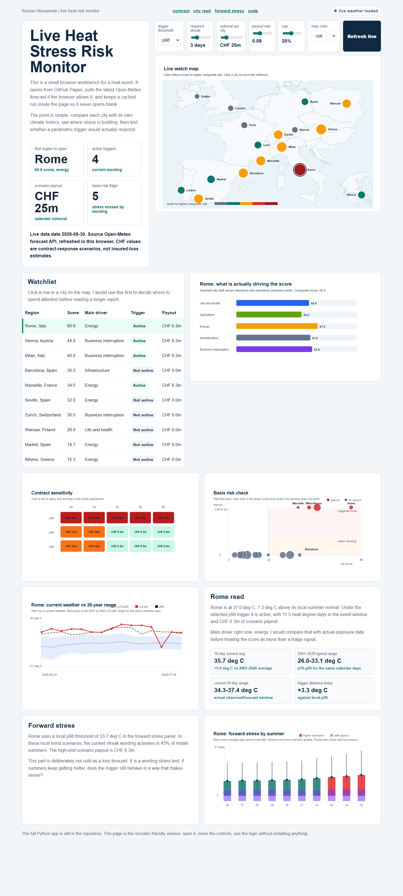

# Live Heat Stress Risk Monitor

[Open the working browser preview](https://romanmski.github.io/europe-heatwave-reinsurance-risk-monitor/)



I built this project because I wanted to make something around a real event, not another clean notebook with perfect data and no context. A heatwave is not just weather. It can affect health, agriculture, power demand, infrastructure, transport, business interruption and insurance exposure at the same time.

The idea was to build a small risk monitor that someone could actually open during a heat event and understand quickly. It should answer basic but important questions. Which regions look stressed right now? Is the stress mostly health, agriculture, energy, infrastructure or business interruption? Would a simple parametric trigger respond, or would there be basis risk where the situation looks bad but the payout stays at zero?

The public version runs directly in the browser through GitHub Pages. It tries to refresh the latest Open-Meteo forecast data when the page opens. If that request fails, it still works from an embedded cached run, so the page does not break or open blank. The map, watchlist and selected-city charts update when the city, trigger threshold, streak length, notional, payout rate, cap or map color are changed.

Under the hood, each city is compared with its own local climate history. The public drilldown shows a 2001 to 2020 range for the same calendar days, then builds a transparent heat stress score and splits it into practical pressure points. I kept the assumptions visible on purpose, because for risk work I think it is more useful to see what drives the result than to hide everything inside a black box.

This is not meant to be a production catastrophe model or underwriting tool. It does not use real insured values, claims, policy wording, treaty terms or accumulation data. The point is to show that I can take a live external event, fetch and structure data, make reasonable assumptions, build an interactive tool and communicate the result in a way that is actually usable.

To run the full app locally on Windows, double-click `run_local.bat`. From a terminal you can also run:

```bash
python -m pip install -r requirements.txt
streamlit run app.py
```
